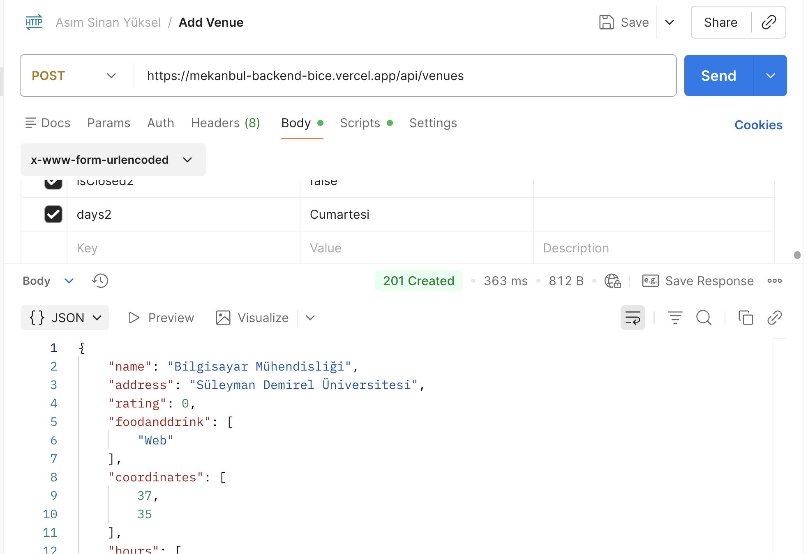
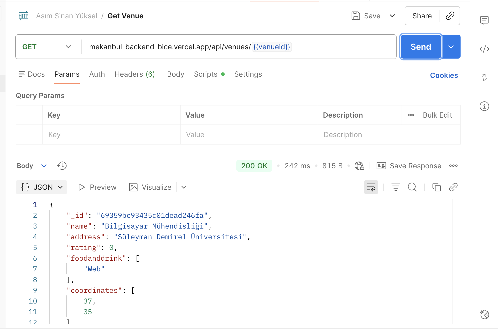
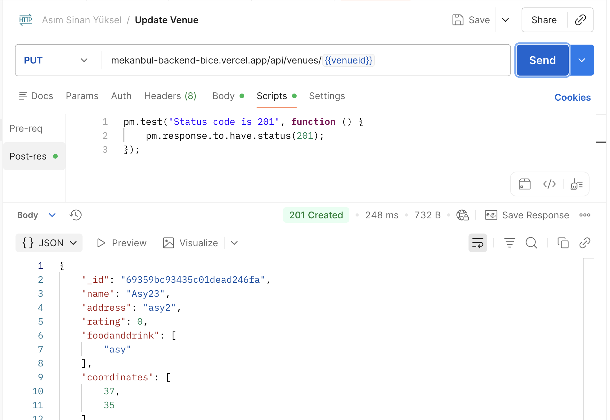
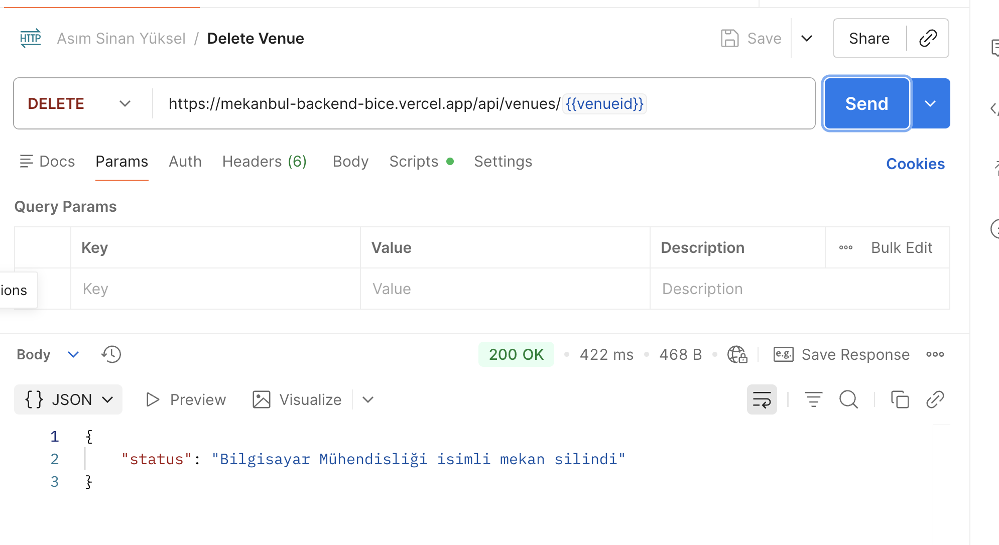
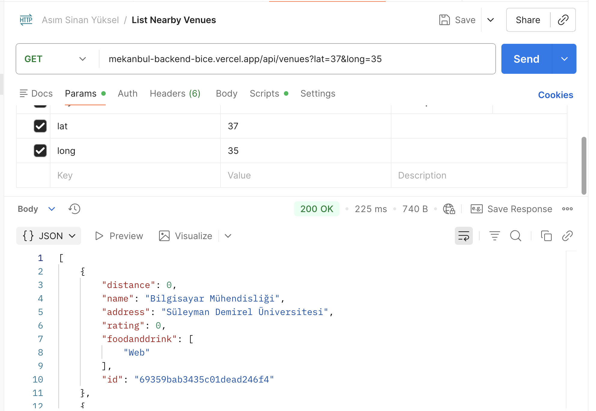
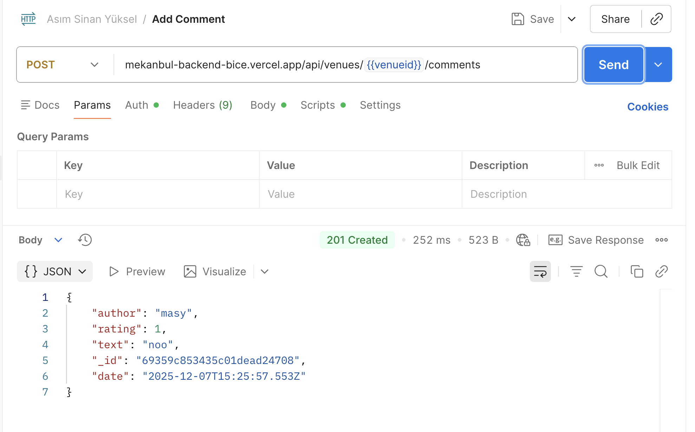
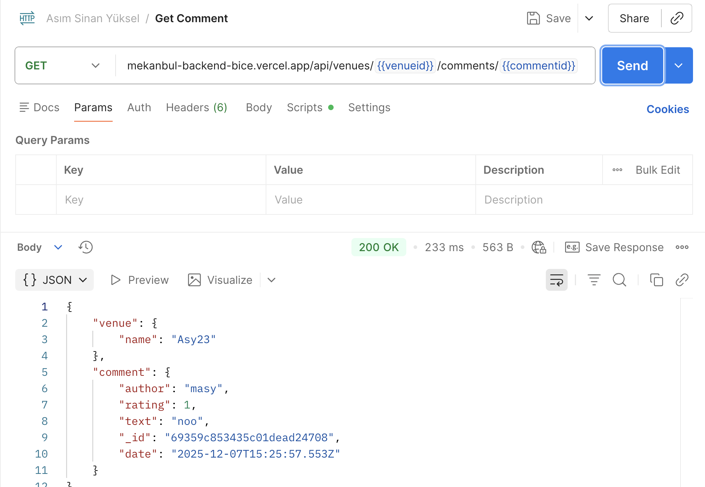
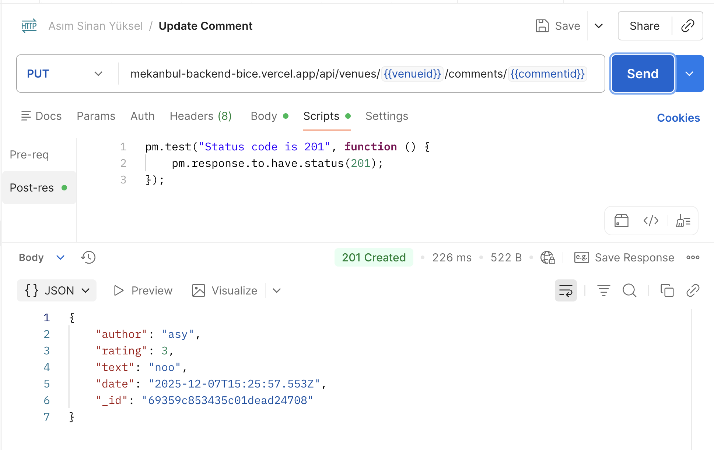
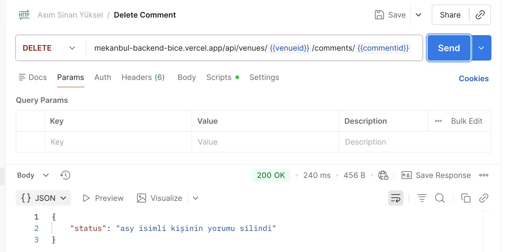

# Mekanbul Backend


Bu repo `mekanbul-backend` uygulamasının basit Node.js + Express + Mongoose backend'idir.

**Kısa Açıklama:**
- API, mekan (venue) verilerini yönetir: listeleme, ekleme, görüntüleme, güncelleme ve silme.
- MongoDB Cloud kullanır.Varsayılan olarak yerel veritabanına (Localhost) bağlanacak şekilde ayarlanmıştır.

Projeyi çalıştırmak için ana dizinde `.env` dosyası oluşturup aşağıdaki satırı ekleyiniz:
`MONGODB_URI=mongodb://localhost/mekanbul`

**Kurulum**
```bash
cd /path/to/backend
npm install
```

**Uygulamayı çalıştırma**
```bash
npm start
```

**API Endpoints**

- Tüm mekanları listele: `GET /api/venues`
- Yeni mekan ekle: `POST /api/venues`
- Mekan detayını getir: `GET /api/venues/:venueid`
- Mekanı güncelle: `PUT /api/venues/:venueid`
- Mekanı sil: `DELETE /api/venues/:venueid`
- Yorum ekle (mekana): `POST /api/venues/:venueid/comments`
- Yorum getir: `GET /api/venues/:venueid/comments/:commentid`
- Yorum güncelle: `PUT /api/venues/:venueid/comments/:commentid`
- Yorum sil: `DELETE /api/venues/:venueid/comments/:commentid`

**Postman Test Sonucu**
Aşağıda Postman ile alınmış test sonuçlarının ekran görüntüsü bulunmaktadır:





















